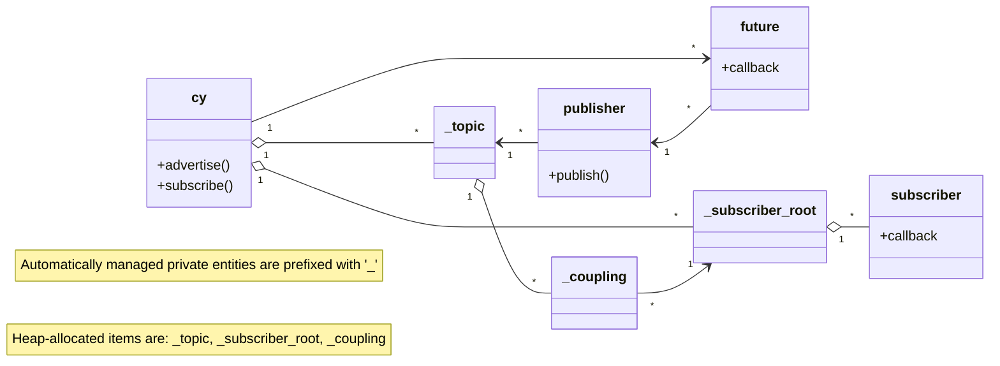

# Experimental zero-configuration decentralized Cyphal with named topics

A minimalist Cyphal extension adding named topics that are automatically allocated in the subject-ID space without a central coordinator. A simple decentralized node-ID autoconfiguration protocol is added as well.

The basic requirements are as follows:

- Discriminate data flows using descriptive string names instead of integer port-IDs.
- Allow nodes to join the network with zero prior configuration of the protocol (at least above the physical layer).
- Introduction of new topics and/or nodes must not disturb operation of the existing participants.
- A fully converged network must offer a service quality at least as good as a statically configured network.
- The autoconfiguration protocol must be stateless and must not require central coordinators or special nodes.
- Retain backward compatibility with old Cyphal nodes that do not support named topics.
- Preferably, the background service traffic should be exchanged at a constant rate to simplify latency and throughput analysis.
- Once a stable configuration is found, it should be possible to store it in the non-volatile memory per node for instant recovery after power cycling, bypassing the autoconfiguration stage. Obsolete or incorrect per-node configuration should not affect the rest of the network. This ensures that a vehicular network with named topics will perform identically to a fully statically configured one until its configuration is changed.
- Scalability beyond a thousand of nodes and topics per network.
- The solution should be implementable in under 1k lines of C without dynamic memory or undue computing costs for small nodes.
- Support subscriptions with wildcard topic name matching / name substitution. See <https://forum.opencyphal.org/t/rfc-add-array-of-ports/1878>

Stretch goals:

- Optional reliable transfers with ack/retry

## TL;DR

```c
// SET UP LOCAL NODE.
// The initial configuration is platform- and transport-specific, unlike the rest of the API.
struct cy_udp_posix_t cy_udp_posix; // In this example we're running over Cyphal/UDP, this node runs on POSIX.
cy_err_t res = cy_udp_posix_new(&cy_udp_posix,
                                local_unique_id,  // 64-bit composed of VID+PID+IID
                                "my_namespace",   // topic name prefix (defaults to the local node UID if empty)
                                (uint32_t[3]){ udp_parse_iface_address("127.0.0.1") },
                                1000);            // tx queue capacity per interface
if (res != CY_OK) { ... }

// The rest of the API is platform- and transport-agnostic, except the event loop spinners.
struct cy_t* const cy = &cy_udp_posix.base;

// CREATE PUBLISHERS.
// To interface with an old node that does not support named topics, put the subject-ID into the topic name;
// e.g., `/1234`. This will bypass the automatic subject-ID allocation and pin the topic as specified.
// The last argument is the extent of response messages sent back from the remote subscribers.
// If no responses are needed or expected, set it to zero.
// The "_c" suffix at the end of some functions indicates that the function accepts an ordinary C-string
// instead of wkv_str_t that is used internally throughout.
struct cy_publisher_t my_publisher;
res = cy_advertise_c(cy, &my_publisher, "my_topic", 0);
if (res != CY_OK) { ... }

// CREATE SUBSCRIBERS.
// Subscribers can specify a verbatim topic name or a pattern. Pattern subscribers will actively discover
// topics on the network whose names match the pattern, and automatically subscribe to them in the background.
// There may be multiple local subscribers on the same topic.
struct cy_subscriber_t verbatim_subscription;
res = cy_subscribe_c(cy,
                     &verbatim_subscription,
                     "/other_namespace/my_topic",
                     1024 * 1024,                   // extent (max message size)
                     on_message_received_callback);
if (res != CY_OK) { ... }

// Multiple patterns may match the same topic. For example, "/?/def" and "/abc/*" both match "/abc/def".
// The library does reference counting and routing internally so that each subscriber gets the relevant data
// and topics remain alive as long as at least one subscriber (or publisher) is using it.
struct cy_subscriber_t pattern_subscription;
res = cy_subscribe_c(cy,
                     &pattern_subscription,
                     "/?/my_topic",                 // Will match any segment in place of '?'
                     1024 * 1024,
                     on_message_received_callback);
if (res != CY_OK) { ... }

// SPIN THE EVENT LOOP
while (true) {
    // SPIN THE EVENT LOOP.
    // This part is also platform-specific, but the data API is purely platform- and transport-agnostic.
    const cy_err_t err_spin = cy_udp_posix_spin_once(&cy_udp_posix);
    if (err_spin != CY_OK) { ... }

    // PUBLISH MESSAGES (no need to do anything else unlike in the case of subscription)
    // Optionally we can check if the local node has a node-ID. It will automatically appear
    // if not given explicitly at startup in a few seconds; once appeared, it will always remain available,
    // but it may change if a collision is discovered (should never happen in a well-managed network).
    if (cy_joined(cy)) {
        char msg[256];
        sprintf(msg, "I am %016llx. time=%lld us", (unsigned long long)cy->uid, (long long)now);
        const struct cy_buffer_borrowed_t payload = { .view.data = msg, .view.size = strlen(msg) };
        const cy_err_t pub_res = cy_udp_publish1(cy, &my_publisher, now + 100000, payload);
        if (pub_res != CY_OK) { ... }
    }
}
```

Build-time dependencies, all single-header-only:

- [`cavl2.h`](https://github.com/pavel-kirienko/cavl) -- AVL tree.
- [`wkv.h`](https://github.com/pavel-kirienko/wild_key_value) -- key-value container with fast pattern matching & routing.
- [`rapidhash.h`](https://github.com/Nicoshev/rapidhash) -- a good 64-bit hash by Nicolas De Carli (BSD 2-clause license).

## Solution

### Node-ID autoconfiguration

The new node-ID autoconfiguration protocol does not require an allocator; instead, a straightforward address claiming procedure is implemented:

1. When joining the network without a node-ID preconfigured, the node will listen for a random time interval ca. 1~3 seconds. The source node-ID of each received transfer (heartbeats or whatever else may occur) is marked as taken in a local bitmask. If the transport layer has a large node-ID space (which is the case for every transport except Cyphal/CAN), the bitmask is replaced with a Bloom filter, whose bit capacity defines the maximum number of nodes that can be autoconfigured in this way (e.g., a 512-byte Bloom filter allows allocating at least 4096 nodes).

2. When a new node is discovered, the listening time is extended by a random penalty ca. 0~1 seconds. This is to reduce the likelihood of multiple nodes claiming an address at the same time.

3. Once the initial delay has expired, an unoccupied node-ID is chosen from the bitmask/Bloom filter and marked as used. The first heartbeat is published immediately to claim the address.

If a node-ID conflict is discovered at any later point, even if the node-ID was configured manually, we repeat step 3 only; i.e., simply pick a new node-ID from the Bloom/mask. In case of high node churn the Bloom/mask will eventually become congested; when the congestion is imminent, the entire filter state is dropped and then gradually rebuilt from scratch in the background.

This method is stateless and quite simple (~100 LoC to implement), and ensures that existing nodes are not disturbed by newcomers. However, it doesn't guarantee no-disturbance if the network is partitioned when new participants join; in that case, once the network is de-partitioned, collisions may occur. To mitigate that, the collision monitoring is done continuously, even if a node-ID is manually assigned, and nodes should save the node-ID, once allocated, into the non-volatile memory, such that a stable configuration, once discovered, remains stable, and nodes can bypass the autoconfiguration delay at boot unless joining the network for the first time.

In the spirit of RFC 4429, I call this solution *Pessimistic DAD*, because each participant defers picking an address until it has been observed to be unoccipied.

### Subject-ID autoconfiguration

A kind of CRDT is used to build distributed consensus between nodes on how to allocate subject-IDs to topics. Each node is only aware of its own topics; nobody keeps the full set. Any node can offer a new allocation; at any time during or after the offering, another node may object, in which case arbitration is performed, and the loser is evicted from the current subject-ID assignment and has to offer a new allocation. If a divergent allocation is discovered (same topic maps to different subject-IDs), another arbitration is performed to detect which allocation needs to be repaired. Allocations that have been around longer OR those that are being used more often aways win arbitration, which ensures that a newcomer cannot override existing network configuration; thus, existing topics and nodes are not affected when new nodes or topics join the network.

For the purposes of the subject-ID allocation CRDT, the topic name is replaced with its *topic hash*. Ordinarily it is simply a 64-bit Rapidhash of the name. A special case applies if the topic has to be compatible with old Cyphal nodes that do not support named topics, and thus it has to be *pinned* to a specific subject-ID: the name of a pinned topic is simply its decimal subject-ID prefixed with a `/`, and the hash of a pinned topic equals its subject-ID.

For a non-pinned topic, the subject-ID allocated to it equals `(hash+evictions)%6144`, where evictions is the number of times the topic had to be moved due to losing arbitration to a contender for the same subject-ID. As can be seen, dynamically assigned subject-IDs fall in the range [0,6144); the remaining range [6144, 8192) is reserved for pinned topics and fixed subject-IDs. It is possible to pin a topic at any subject-ID, not necessarily in the reserved range, but in the presence of nodes that do not support the named topic protocol pinning below 6144 is not recommended because old nodes will be unable to participate in conflict resolution.

CRDTs are eventually convergent by design; thus, as long as nodes are able to communicate, eventually they will find a consistent (only one subject-ID per topic) and conflict-free (only one topic per subject-ID) configuration. While the network is still converging, however, brief conflicts will likely occur. To avoid data misinterpretation, transfers emitted over named topics are extended with at least some of the most significant bits of the topic hash (the 16 least significant bits of the topic hash are already used to compute the subject-ID and as such they are not usable for hashing, so we are left with 48 bits).

How the topic hash is used at the transport layer depends on the specifics of the transport. At least a part of it should be used to populate a field in the transport frame header to allow quick acceptance filtering and detection when another topic is occupying our subject-ID. Another part can be used to seed the transfer-CRC. Observe that the most significant bits of the topic hash are zero for a pinned topic, which ensures backward compatibility with any v1.0 node.

When receiving a transport frame, the transport layer will compare the relevant most significant bits of the topic hash provided by the topic autoconfiguration protocol against the value in the received frame. If a divergence is found, the topic autoconfiguration engine is notified, such that it assigns a higher priority to resolving the conflict as soon as possible (this notification is not essential for the protocol to function, since the CRDT will eventually converge regardless, but it does speed up conflict resolution), and the frame is discarded. This is called stochastic multiple occupant monitoring, or *Stochastic MOM*.

Assuming perfect hashing (this is a ~sensible assumption for Rapidhash but an overly optimistic one for CRCs), the probability of Stochastic MOM failure -- i.e., data misinterpretation -- given 1000 topics and using *only 32 bits* from the topic hash is 1.89e-8, or one in 53 million. If the topic hash is used to seed a CRC, the probability will somewhat increase.

It is essential to ensure that existing topics are not affected by new ones. To this end, each topic bears an age counter, which defines the priority of the topic during arbitration. The age counter should increase with time and usage of the topic. Currently, it is incremented whenever the topic is gossiped, and whenever a transfer is received (sic!) on the topic. Publishing a transfer does not increase the age because the publisher may be unconnected to subscribers. The age counter is CRDT-merged using siple max(), as a result, the counter grows faster as the number of nodes using the topic is increased.

CRDTs only guarantee convergence when the system has been quiescent for a while, but the age counter is incremented continuously, meaning that its local replicas may normally be slightly different across nodes, which impairs convergence and may result in ping-pong topic reassignment. One possible solution is to slow down the counter such that it is not incremented faster than the new values may propagate through the network. This will work, but the optimal counting rate will depend on the number of topics (networks with more topics will converge slower so they prefer slower counters) and how often new topics join the network (networks that see much topic churn will prefer faster counters). A good solution could drive the counter faster while the topic is young, gradually slowing it down with age, such that the counter provide higher resolution for high-churn networks and at the same time reduce jitter over time in larger networks. One way to achieve that is to replace the raw age counter value with its $\lfloor\log_2(\text{age})\rfloor$ during arbitration, assuming value -1 if the age is zero.

Some networks will not tolerate the initial configuration stage while the protocol is working toward consensus, as this delay may be several seconds long in larger networks. To avoid this, nodes should ideally store the last stable subject-ID assignments in the non-volatile memory, such that they are able to resume normal operation immediately at next power-on without the need to wait for the network to converge again. Shall that configuration become obsolete (e.g., firmware update changes network configuration in other nodes), no issues are expected because the protocol will address divergences and collisions using its normal algorithm.

The protocol itself does not put any constraints on the topic name syntax. For the protocol, a topic name is just an arbitrary byte string, with one exception made for pinned topics for reasons of backward compatibility: `/[1-9][0-9]{0,4}`.

### Heartbeat extension

The topic allocation protocol data is exchanged at a fixed rate via CRDT gossip messages, which are piggybacked on the heartbeat subject. The heartbeat message is redefined to add new topic metadata while retaining wire compatibility with the original version.

A new 64-bit globally unique node-ID is defined that replaces both the old 128-bit unstructured UID and the transport-dependent small node-ID. The new UID is composed of 16-bit vendor-ID, 16-bit product-ID, and 32-bit instance-ID.

The named topic protocol somewhat lifts the level of abstraction presented to the application. Considering that, it does no longer appear useful to include the application-specific fields `health` and `mode` in the heartbeat message. Instead, applications should choose more specialized means of status reporting. In this proposal, these two fields along with the vendor-specific status code are consumed by the new `uint32 user_word`. Applications that seek full compatibility with the old nodes will set the two least significant bytes to the health and mode values. Eventually, it is expected that this field will become a simple general-purpose status reporting word with fully application-defined semantics.

- [`7509.cyphal.Heartbeat.1.1`](dsdl/cyphal/7509.Heartbeat.1.1.dsdl)
- [`cyphal.UID`](dsdl/cyphal/UID.0.1.dsdl)

### RPC

A named RPC endpoint has one crucial difference compared to the old RPCs that changes everything in how it's used: a named RPC endpoint is no longer associated with a particular node. Such association was recognized as a design deficiency and discussed in the Cyphal Guide:

>An attentive reader here might notice that \[RPCs\] are inherently bound to node-IDs and as such their ability to participate in well-architected network services is limited. This is a correct observation. This design is one manifestation of Cyphal’s commitment to providing powerful abstractions at zero cost – occasionally, certain trade-offs have to be made. Many practical services will be designed based on subjects alone without relying on \[RPCs\] at all.

We assume here that an RPC endpoint is a first-class named entity similar to named topics in conventional pub/sub systems; for example, ROS services are designed in this way. This implies that each participant always has a bounded, compact set of RPC endpoints it serves or invokes. There is another approach that can be found, for example, in REST APIs, where the set of names is, generally speaking, unbounded, as names themselves may contain RPC endpoint arguments; we ignore this use case for now.

A node wishing to invoke an RPC endpoint must first discover where the point-to-point RPC request should be sent to. This can be accomplished in several ways:

1. Broadcast an ARP-style discovery request before invoking the RPC. The server, if any, will identify itself, allowing the client to send the P2P request transfer to it. This approach assumes a stateful two-stage interaction (the discovery results can be cached though).

2. Broadcast the RPC payload together with the RPC endpoint name (or hash), assuming that the recipient will process the request and everyone else will ignore it. The response can be sent using a P2P transfer to the sender, since the sender's identity is known from the request transfer. This is stateless and simple, but forces every node to sift through each request published on the network.

3. Rely on the existing topic allocation mechanism to find a segregated subject-ID for a topic, which is actually used for sending RPC requests. A request is published as an ordinary message, which is received normally by just one node providing said service. The response is sent using a P2P transfer like in the previous scenario.

This PoC implements the last option as it appears to be by far the most efficient. An interesting side effect of this option is that it actually erases the difference between RPC endpoints and pub/sub topics. A response can be sent to the publisher of any message on any topic, not just some special kind of topic that we designate for RPCs. This opens up some interesting new network service design options.

One implication of this approach is that the same RPC endpoint (i.e., topic) may be served (i.e., subscribed to) by more than one participant. If each responds to a request, this may cause the client to receive multible responses to a request. This can be considered a problem or a feature depending on the design objectives. If a strict one-server-per-endpoint rule must be enforced, both the client and the server (as well as any other node on the network) can monitor for multiple occupancy by simply subscribing to the heartbeat topic, since each node publishes usage flags per topic (pub/sub). However, multiple occupancy can also be used for the greater good to implement **anycast redundant services**, or to **multicast requests to multiple participants at once, while receiving separate responses from each**.

The solution is thus not to introduce RPC as a separate feature at all, but to allow sending peer-to-peer responses to any published message.

The large set of service-ID values becomes redundant in this design. In this PoC, only a single service-ID of 510 (chosen arbitrarily) is used to deliver all P2P responses. A topic message response is sent as an RPC-service request transfer, where the first 8 bytes contain the topic hash to which the response is sent, and the rest of the payload is used for the application data. The transfer-ID of the response matches that of the message that is being responded to, allowing the client to match response with the individual request messages.

The 8-byte topic hash prefix could be replaced with the client-provided RPC-service-ID supplied with each message, instructing the server/subscriber to send the response P2P transfer to the specified service-ID. This saves a few bytes of overhead, but it appears to somewhat increase the complexity of both clients and servers.

RPC demo apps:

- [`main_udp_file_server.c`](examples/main_udp_file_server.c)
- [`main_udp_file_client.c`](examples/main_udp_file_client.c)

## Application API

More or less in line with existing conventions, the API should offer at least:

- Fully specified topic names starting with a name separator: `/topic/name`

- Namespace-prefixed topic names if the leading symbol is not a separator: `topic/name` expands into `/namespace/topic/name`, where the `/namespace` is set on the node instance during its initialization.

- Topics starting with `~` are prefixed with the node name, which itself is derived from UID by default: `~/topic/name` expands into `/abcd/1234/5678ef01/topic/name`, where the UID is 0xabcd12345678ef01, specifically VID=0xabcd PID=0x1234 IID=5678ef01, unless the local name is overridden.

Ideally we should also introduce remappings that locally map a given topic name prefix to another prefix.

The node-ID will disappear from the application scope completely. Ideally, it should be entirely automated away by the transport layer, since now we have the tools for that. Those applications that require fully manual control over the node-ID will still be able to set it up directly at the transport layer.

To interact with old nodes not supporting named topics, pinned topics are used. For example, to subscribe to the old `uavcan.node.port.List` message (not needed for the new design), one will subscribe to topic `/7510`.

There is no interoperability with old RPC services because they are not really exposed to the application directly anymore. To invoke an old RPC service, the application should reach out to the transport library directly.


## Rules

### When publishing

Just publish using the current subject-ID mapping.

The mapping is guaranteed to be correct except during the initial configuration stage. By design, once a stable mapping is found, it will be retained by the current topic, with all new arrivals (e.g., new nodes joining the network, or existing nodes advertising new topics) will be forced to find new subject-IDs.

Applications that require immediate connectivity without the initial configuration delays can store the stable configuration in non-volatile memory.

While the autoconfiguration is in progress, transfers may briefly be emitted on the wrong subject-IDs. The topic hash used by the transport layer is used to avoid data misinterpretation in case of an allocation collision, allowing each subscriber on the oversubscribed subject-ID to pick only relevant transfers.

### When asked to subscribe

Just use the current subject-ID mapping.

If the consensus algorithm later finds a different mapping (e.g., an older topic is found and we need to move), the old subscription will be destroyed and replaced with a new one in the background (this happens from the `on_heartbeat` context).

#### When a message is received

Incement the age counter of the current topic.

### When a new heartbeat is published

1. Using the last gossip time index, pick the topic with the oldest last gossip time.
2. Increment the age counter.
3. Publish the heartbeat with the KV gossip.
4. Set the last gossip time of the topic to the current time.

### When a topic hash collision is observed

Set the last gossip time of the topic to zero.

### When a new heartbeat is received

Check the named resource kind. If the name starts with a slash and ends with `[0-9a-zA-Z_]`, it is a topic name. It is not strictly necessary to deserialize the full name, so some processing effort can be saved on that.

Find the topic by hash in the local node.

#### If we don't know this topic

If the topic is NOT found, find the topic by the allocated subject-ID (which is `(hash+evictions)%6144`) to check if there is a collision. If there is, do a CRDT merge (arbitration):
- Pinned topic wins. Note that both cannot be pinned by design, because pinned topics have hash = subject-ID.
- Otherwise, the topic with the greater $\lfloor\log_2(\text{age})\rfloor$ wins.
- Otherwise, the topic with the smaller hash wins.

If the local topic lost, find another subject-ID for it. Regardless of the arbitration outcome, schedule the topic for gossip out-of-order next to resolve the conflict sooner (if we won) or to inform other nodes that we have moved, because other members of our topic could have settled on a different subject-ID and becase we could have collided with a different topic, since no node stores the full set. It may take several iterations until we settle on a new subject-ID. Each iteration requires resubscription to a new ID, which implies the possibility of data loss because the members of our topic may not switch fully synchronously (although we mitigate that risk somewhat by scheduling next gossip out of order). This is why it is essential that old topics win arbitration, so that newcomers do not disturb the network.

#### If we do know this topic

If the topic is found locally, we need to check for divergent allocations. If the subject-ID is the same, nothing needs to be done except CRDT-merging the age (see below). Otherwise, arbitrate to decide who has the correct subject-ID. If log-age of the local topic is greater than the remote, OR (log-age is the same AND local eviction counter is greater), we win.

1. If the local topic won, schedule it for gossip ASAP to inform the remote participant that it needs to move.
2. If the local topic lost:
  - Merge the local age as max(local age, remote age). This needs to be done first because we're going to be moving the topic next, and it has to have the correct age to arbitrate correctly against possible contenders for the proposed subject-ID.
  - Try moving it to match the remote subject-ID. If there is another local topic and it wins arbitration against this topic (using the same arbitration rules as defined above for external topics), keep looking until a free subject-ID is found. If the other local topic lost, schedule it for gossip next to inform other members of that topic that they have to move, too (NB: they may refuse if we don't know the correct age yet, in which case we will repeat this process later on with a different outcome).
  - If the topic was moved to the exact same subject-ID as the remote, nothing else needs to be done.
  - Otherwise, schedule this topic for gossip ASAP to inform the remote party that we couldn't follow, thus asking it to move a few steps up (increase the eviction counter). This ping-pong will continue until a slot is found that no one objects against.

Regardless of the above steps, merge the local age as max(local age, remote age).


## Compatibility with old nodes

From an integrator standpoint, the only difference is that topics are now assigned not via registers as numbers, but as topic name remappings as strings: `uavcan.pub.my_subject.id=1234` is now a remapping from `my_subject` to `/1234`.


## Implementation notes




## Missing features

### Type assignability checking

There is currently no robust solution on the horizon, but one tentative solution is to suffix the topic name with the type name. For example, if we have `zubax.fluxgrip.Feedback.1.0`, the topic could be named `/magnet/rear/status.fb1`, where `.fb1` hints at the type name and version.

### Retirement of automatically created topics with no publishers

Pattern subscribers (e.g., `/?/foo/*`) will automatically create new topics in the background when gossips matching the pattern are received. This will create issues with small nodes if the network sees some topic churn, because it will leave local tombstones taking up memory (computationally they are basically ~free).

The solution is simple: maintain a new topic index that only contains topics *without local publishers* that are *coupled only with pattern subscribers* ordered by *last extrinsic activity*. Extrinsic activity is the reception of a heartbeat gossiping that topic, or receiving a transfer on that topic. Updating the index on every received transfer might be computationally expensive if it's an AVL tree; perhaps it could be replaced with a doubly-linked list, where on each update the topic is simply moved to the end, which is a constant-complexity operation; the oldest topic will be kept in the beginning of the list.

The automatic retirement timeout should be set to a value greater than the topic scalability limit (say 1000 topics) times maximum heartbeat period (let's say 0.5 seconds), so ~10 minutes. There should be API to override this value.

Alternatively, the user could specify the maximum number of automatic subscriptions, so that when the number is exceeded, the library will retire the oldest topic. This may cause subscription churn if not used carefully though.


## Changes to the transport libraries: libudpard, libcanard, libserard, etc.

### Pessimistic DAD fully managed by the transport libraries

Implement the pessimistic duplicate address detection (DAD) method as the new node-ID assignment policy, while still allowing fully manual assignments for the benefit of applications that require full control over the transport.

The Pessimistic DAD requires a long-sequence PRNG, which can be as simple as the standard SplitMix64 or Rapidhash seeded with the node's 64-bit UID. In addition, a large Bloom filter is needed: 8~16 bytes for Cyphal/CAN, 512~1024 bytes for the other transports.

The transport libraries will be fully responsible for managing the node-ID, unless it is assigned manually. Even in the case of manual assignment, the collision monitoring will be done continuously for safety reasons; shall a collision be discovered, the current node-ID will be abandoned regardless of whether it's assigned manually or automatically.

The application will need to be notified when the local node-ID is changed to perform some transport-specific migration activities:
- Cyphal/UDP: rebind the RPC RX socket to the new mcast endpoint.
- Cyphal/CAN: update the acceptance filter for RPC frames.

The overall cost of the Pessimistic DAD is about 100~200 extra lines of code per transport library.

### Extensions to support stochastic MOM

Stochastic multiple occupant monitoring (MOM) mixes at most 48 of the most significant bits of the topic hash into the transfer such that only transfers that carry the expected topic hash can be correctly received. This prevents data misinterpretation during the topic allocation phase, when multiple topics may briefly occupy the same subject-ID until the new conflict-free consensus is found by the network. How the topic hash is leveraged depends on the specific transport.

When the transport detects a topic hash mismatch, it has the option to notify the CRDT protocol so that it can assign a higher priority to the topic where the conflict is found. It is not essential because even if no such notification is delivered, CRDT will eventually reach a conflict-free consensus, but the time required may be longer.

#### Cyphal/UDP and Cyphal/serial

The 16-bit user data field of the frame header will contain some of the 16 bits of the topic hash. Other 32 bits will be inverted and the result will be used to seed the transfer-CRC; the current initial value of the transfer-CRC is 0xFFFFFFFF, meaning that pinned topics (whose hash is zero) will remain compatible with the old non-named topics. The three leftover bits could be discarded or used to populate a new small field of the header.

This results in a robust hash (6144 subject-IDs times 2^16 in the user word times 2^32 in the transfer CRC seed, also the optional three leftover bits could be added) that is expected to scale to very large networks even with multiple thousands of topics.

#### Cyphal/CAN

The CAN ID format only offers two bits for the topic hash: 21 and 22. Other 16 bits will be used to seed the 16-bit transfer-CRC (the default initial value of CRC-16-CCITT-FALSE is already zero). This excludes single-frame CAN transfers, though.

The collision detection capability of this scheme is poor as we only introduce 18 bits of hash, which means that named-topic networks based on CAN will not scale to large numbers of topics. Together with 6144 possible subject-ID values, the probability of an undetected hash collision given 40 topics (optimistically assuming perfect hashing, which is not accurate) is 4.8e-7, or one in two million. The actual probability is higher considering the limitations of CRC algorithms when used for hashing. Usage of this mechanism in larger CAN networks (more than about thirty-forty topics) is unsafe and requires changes to the CAN frame format.

The above only applies to multi-frame transfers over CAN, since single-frame Cyphal/CAN transfers do not include the payload CRC, unlike the other transports. One quick and dirty solution to enable collision-safe named topics on CAN networks without nontrivial changes to the Cyphal/CAN layer is to pad the payload with zeroes such that it is at least 1 byte larger than the MTU (i.e., at least 8 bytes in Classic CAN networks, at least 64 bytes in CAN FD networks). Such zero padding is guaranteed to not alter the interpretation of the payload due to the implicit zero extension/truncation rules. This **does not affect pinned topics** since they are conflict-free by design; they can still remain unpadded and thus efficient.
